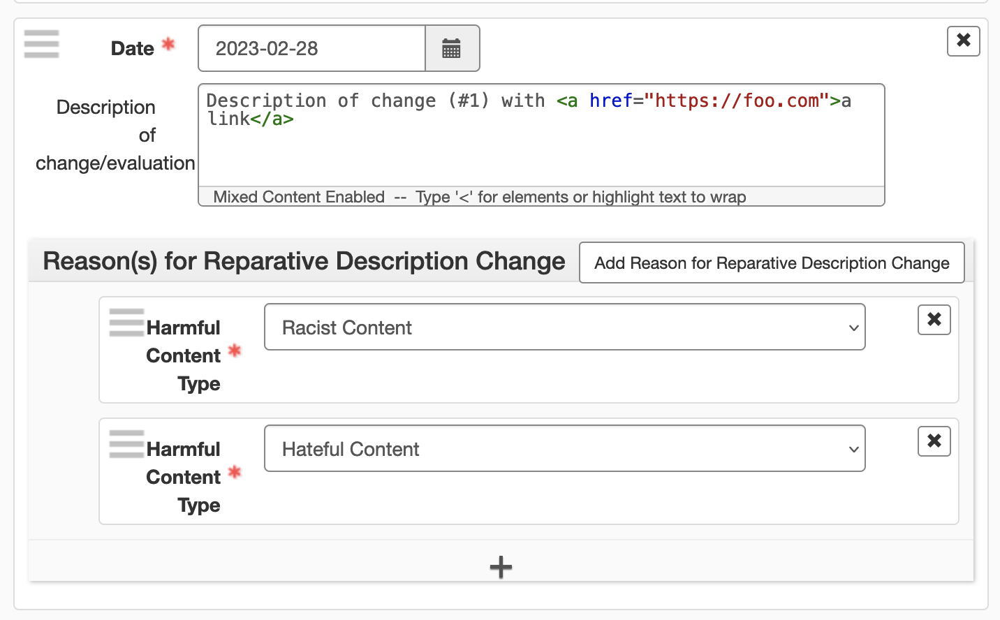
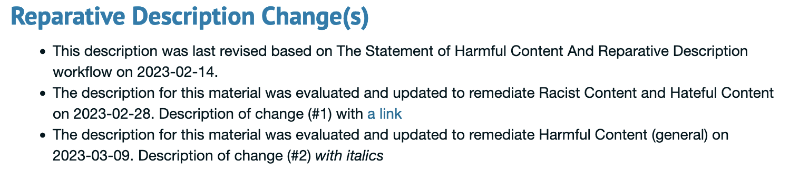

ArchivesSpace Reparative Descriptions
=====================================

## Getting started

This plugin has been tested with ArchivesSpace versions 3.3.1+. It depends on the 
plugin Aspace Content Warnings https://github.com/dartmouth-dltg/aspace_content_warnings

Unzip the latest release of the plugin to your
ArchivesSpace plugins directory:

     $ cd /path/to/archivesspace/plugins
     $ unzip aspace_reparative_descriptions.zip -d aspace_reparative_descriptions

Enable the plugin by editing your ArchivesSpace configuration file
(`config/config.rb`):

     AppConfig[:plugins] = ['other_plugin', 'aspace_reparative_descriptions']

(Make sure you uncomment this line (i.e., remove the leading '#' if present))

See also:

  https://github.com/archivesspace/archivesspace/blob/master/plugins/README.md

You will need to shut down ArchivesSpace and migrate the database:

     $ cd /path/to/archivesspace
     $ scripts/setup-database.sh

See also:

  https://github.com/archivesspace/archivesspace/blob/master/UPGRADING.md

This will create the tables required by the plugin.

## Configuration

This plugin accepts four configuration options which 

1. control the visibility of Reparative Description Changes as facets in the staff application
1. allow for a user selectable ead tag for the information
1. sets your Library's MARC organization code
1. sets the sort order in the PUI display and in all exports

Set `AppConfig[:aspace_reparative_descriptions_faceting]` to `true` to enable the staff faceting

Set `AppConfig[:aspace_reparative_descriptions_note_type]` to `odd` or `processinfo`. Defaults
to `processinfo`.

Set  `AppConfig[:aspace_reparative_descriptions_org_code]`. Defaults to 'xxx'. For example, Dartmouth Library's
org code is 'NhD'.

Set `AppConfig[:aspace_reparative_descriptions_sort]` to `asc` or `desc`. Defaults to unordered - i.e. 
the order as added in the staff interface.

## Using the Plugin

The plugin adds a new sub record to Accessions, Resources, Archival Objects, Digital Objects, 
and Digital Object Components (WIP).

The new sub record allows staff users to record reparative description changes. These can be as
simpleas a date, or include a custom descrption of what was changed and what type of harmful content
was remediated. The choice of harmful content types is the same as the controlled value list 
supplied by the harmful content plugin.

### Note on customizing default language

To customize the supplied statements, edit the appropraite locales file entries for

```
reparative_description_reasons_template: The description for this material was evaluated and updated to remediate %{reasons} on %{date}.
```
and
```
reparative_description_reasons_generic: This description was last revised based on The Statement of Harmful Content And Reparative Description workflow on %{date}.
```

### Staff editing UI


If an object has been labeled directly, the plugin adds new data to the accordion section in the
PUI which lists out the warnings applied and the custom description if added. A generic description
is applied if no custom description is available.

## PUI Section


### PUI PDF Export

The PUI PDF exports have also been modified to include the reparative description changes. 
Digital Object Components are not included in PUI PDFs. Digital Object tags are only included 
if one or more file versions are present in the pdf.

A sample PUI pdf export is included in the `sample_exports` directory.

## Reports

The plugin adds an additional report that gathers information about the reparative description changes. The
report includes the change and any associated primary type (resource, accession, archival object,
digital object, and digital object component).

## Staff MARC, EAD & PDF Exports Note

EAD, EAD3, and pdf exports include sections with reparative description changes. These are included in 
`<processinfo>` tags. Digital Object Components are not included in exports.

MARC exports include an additional 500 field for each applied change. Example: 500##$a{ReparativeDescription}$5{Library_Code}

## Core Overrides

This plugin overrides the following views
```
    /public/views/pdf/_archival_object.html.erb
    /public/views/pdf/_digital_object_links.html.erb
    /public/views/pdf/_resource.html.erb 
```
If you are using other plugins which override the same files, you will need to reconcile
them.

## Credits

Plugin developed by Joshua Shaw [Joshua.D.Shaw@dartmouth.edu], Digital Library Technologies Group
Dartmouth Library, Dartmouth College
